# Proyecto de visualización

* **Autor:** Jorge Cabrera Rodríguez
* **Email:** alu0101351773@ull.edu.es

## Análisis de defunciones

Lo primero que he explorado en este proyecto de visualización son las defunciones por tipo en diferentes municipios canarios. Para esto me he limitado a los municipios de la isla de Tenerife, pues es la isla com más municipios de la que más información variada se podrá extraer.

Esta información la he desglosado por año, dando como resultado los siguientes gráficos:

### Defunciones por municipio en 2019

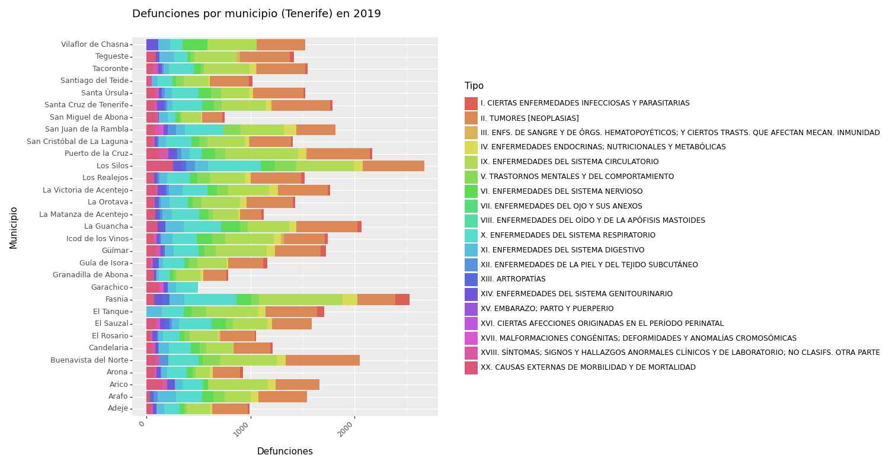

En este gráfico podemos observar la distribución de defunciones por cada municipio tinerfeño acompañado del tipo de defunción. La mayor parte de municipios cuentan con defunciones por:

* Causas externas de mobilidad
* Enfermedades del sistema genitourinario
* Enfermedades del sistema respiratorio
* Enfermedades del sistema circulatorio
* Tumores

Existen algunos municipios anómalos que no presentan enfermedades comunes, como puedan ser:

* Vilaflor de Chasna: No presenta muertes por morbilidad.
* El Tanque: No presenta enfermedades del sistema respiratorio.

En este gráfico destacan las elevadas muertes por **tumores** y **enfermedades del sistema circulatorio** ocurridas en el **Puerto de la Cruz** y **Fasnia**. Estos datos resultan curiosos, sobre todo sabiendo que la población de estas zonas es notablemente menor que la de municipios como **San Cristobal de La Laguna** o **Santa Cruz de Tenerife**.

### Defunciones por municipio en 2020

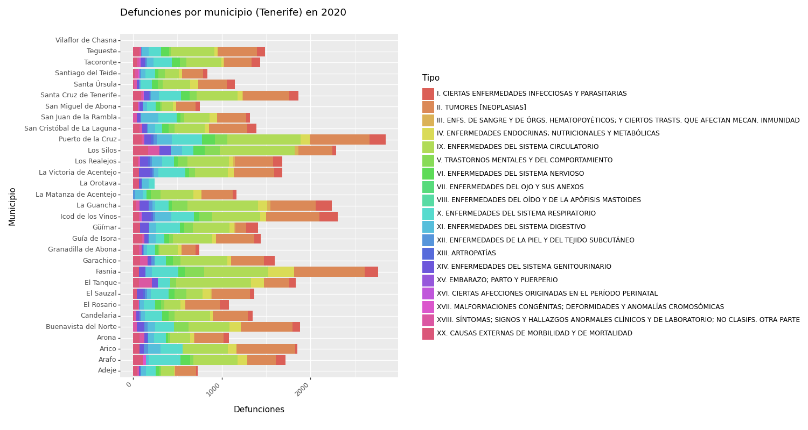

En este nuevo gráfico se puede observar cómo ciertos municipios han variado drásticamente su tasa de defunciones:

* La Orotava redujo sus defunciones a mínimos.
* Garachico tuvo un repunte de muertes frente al año anterior 2019.
* El Tanque tuvo también un repunte de muertes por enferemdades del sistema circulatorio comparado al año anterior.

En este gráfico me han llamado la atención dos municipios: Puerto de la Cruz y Fasnia. En ambos, las muertes por defunciones se siguen manteniendo extremadamente elevadas, y con resultados similares al año anterior.

### Defunciones por municipio en 2021

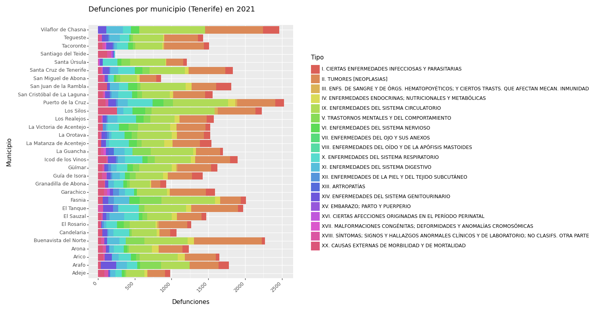

En este gráfico volvemos a observar la elevada cantidad de defunciones en **Puerto de la Cruz** y **Fasnia** mantenidas en el tiempo. Por esto, he decidido observar en detalle la información de estos municipios.

## Visualización de muertes por **tumores** y **enfermedades circulatorias** en Tenerife

Para comprobar la frecuencia de las muertes por **tumores** y **enfermedades circulatorias**, se han plasmado en un mapa de frecuencias. Aquellos municipios sin datos de defunciones no aparecen representados en el mapa, dando el siguiente resultado:

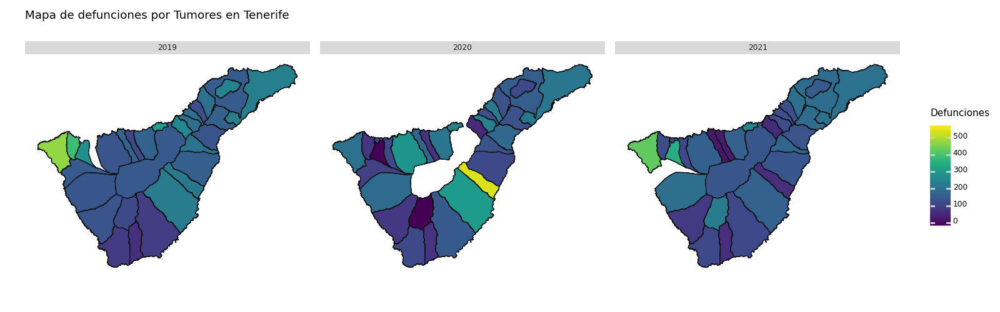

En este mapa se puede observar cómo las muertes por tumores en el municipio de **Puerto de la Cruz** se mantienen constantes en los años. Además de eso, podemos ver los picos de muertes de **Buenavista** en 2019 y 2021, y de **Fasnia** en 2020.

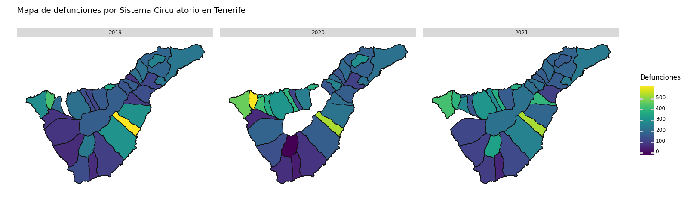

En este otro mapa (mucho más acentuado que el anterior) se pueden observar municipios con una alta tasa de muertes por motivos circulatorios. Destacan los municipios de:

* **Buenavista** en el año 2020.
* **Puerto de La Cruz** desde 2019 hasta 2021.
* **Los Silos** con valores intermedios en 2019 y 2021 y un repunte muy elevado en 2020.
* **Fasnia** con los valores elevados más constantes de todo el mapa durante 3 años.

## Distribución de ocupación laboral en poblaciones afectadas

Como se ha observado en los anteriores gráficos, parece haber un patrón de defunciones elevado en los municipios de **Puerto de la Cruz** (tumores y Enfermedades circulatorias) y **Fasnia** (Enfermedades Circulatorias).

Se me ha ocurrido investigar la posible relación de estas defunciones respecto a sus principales sectores de ocupación laboral, en busca de algún patrón. Para ello, he tomado como "Municipio de contraste" a "San Miguel de Abona" para comparar los resultados, ya que este municipio no destaca por su número de defunciones.

### Ocupación laboral en San Miguel de Abona

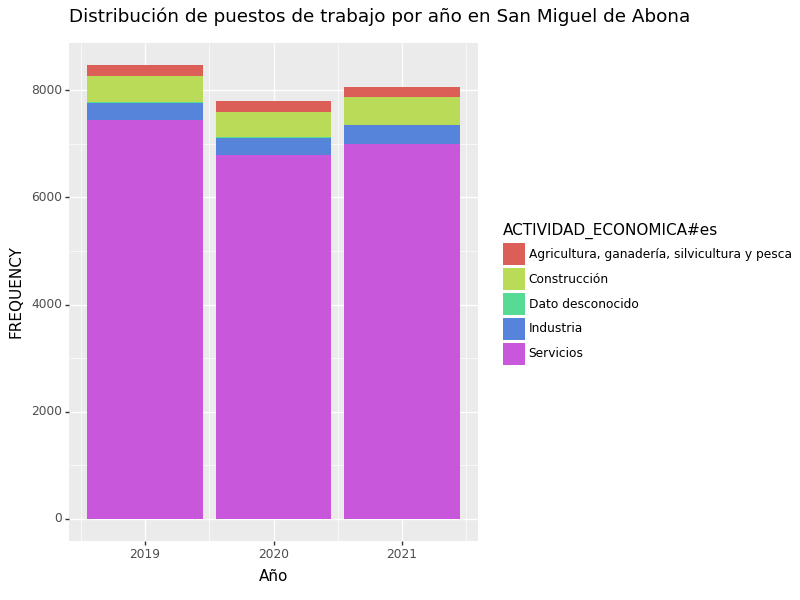

Se puede observar que el sector predominante en **San Miguel de Abona** es el sector "Servicios", seguido por el sector "Construcción". El sector "Construcción" y los demás sectores menos frecuentes no parecen ser muy representativos, pues apenas constituyen una décima parte del total de sectores.

### Ocupación laboral en Puerto de La Cruz

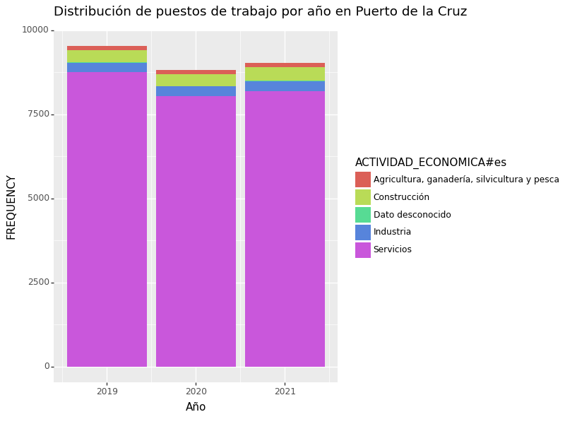

La ocupación laboral mayoritaria en **Puerto de la Cruz** es mucho más marcada que en el resto de municipios: El sector "Servicios" destaca como la fuerza económica al ser este un municipio enfocado al turismo.

Puede que exista alguna relación aparente entre los tipos de puestos de trabajo y las defunciones por tumores o problemas circulatorios, pero con los datos disponibles no parece haberla.

### Ocupación laboral en Fasnia

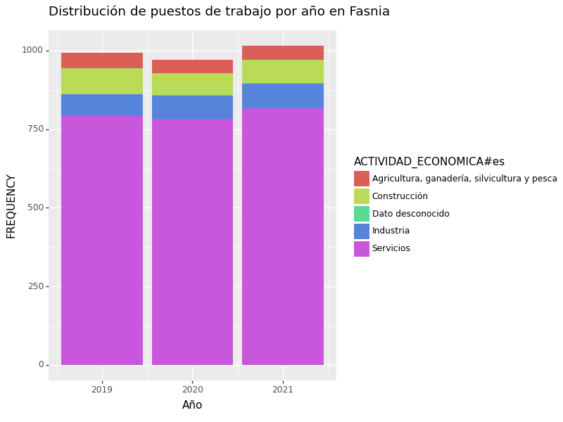

El caso de **Fasnia** es el opuesto al puerto, pues la distribución de actividades económicas es más pareja. El sector "Servicios" sigue siendo el mayoritario, pero el resto de sectores combinados acumulan casi un quinto del total de trabajos. Con esta visualización podría ser interesante realizar un estudio sobre si el sector de la "Construcción" o la "industria" es más propenso a defunciones por riesgos circulatorios.

## Distribución de edad en poblaciones afectadas

Hasta ahora se ha observado una proporción de trabajadores del sector de la construcción y de la industria elevada en Fasnia, municipio afectado por muertes del sistema circulatorio. Sin embargo, las estadísticas del Puerto de la Cruz no parecen mostrar ese porcentaje de población.

Buscando posibles relaciones entre datos, he analizado también la distribución de edades de las poblaciones afectadas en busca de posibles patrones de datos.

### Patrones de edad en San Miguel de Abona

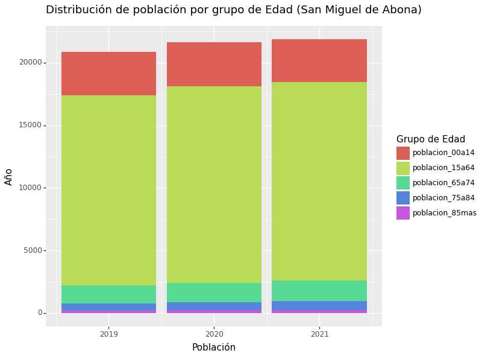

Se observa que la proporción de población de edad avanzada (65 años o más) en San Miguel de Abona es pequeña, mientras que la proporción de la población jóven (de 0 a 14 años) es elevada.

### Patrones de edad en Puerto de la Cruz

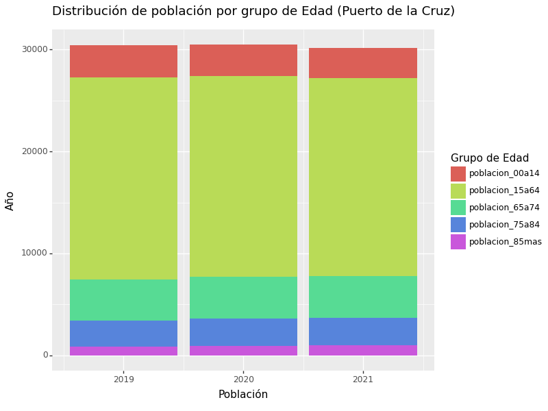

La franja de edad avanzada en el municipio es bastante mayor, debido en parte a ser un municipio turístico donde residen muchos turistas ancianos.

### Patrones de edad en Fasnia

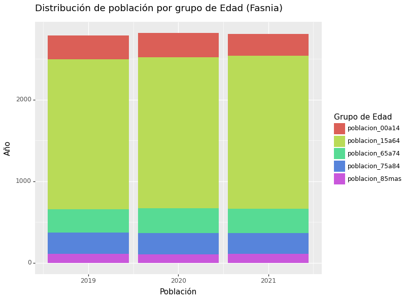

La franja de edad avanzada en este municipio es similar a la observada en Puerto de la Cruz, con mayor abundancia de población mayor de 85 años. Esta mayor proporción de población mayor en ambos municipios podría tener relación con la mayor tasa de defunciones por enfermedades circulatorias, lo que sería objeto de investigación.